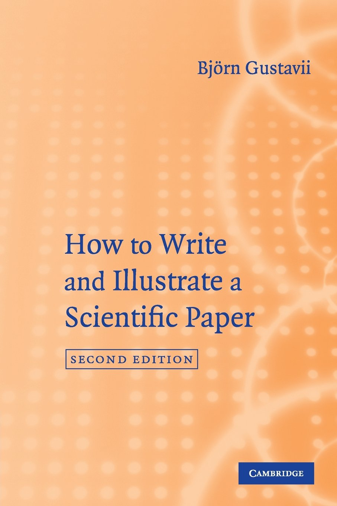
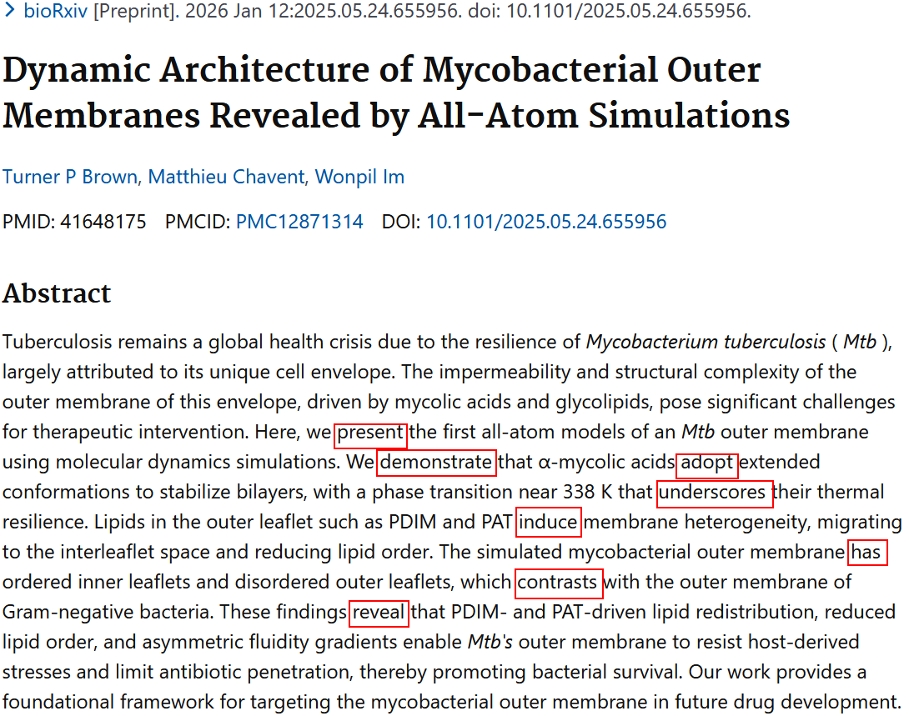
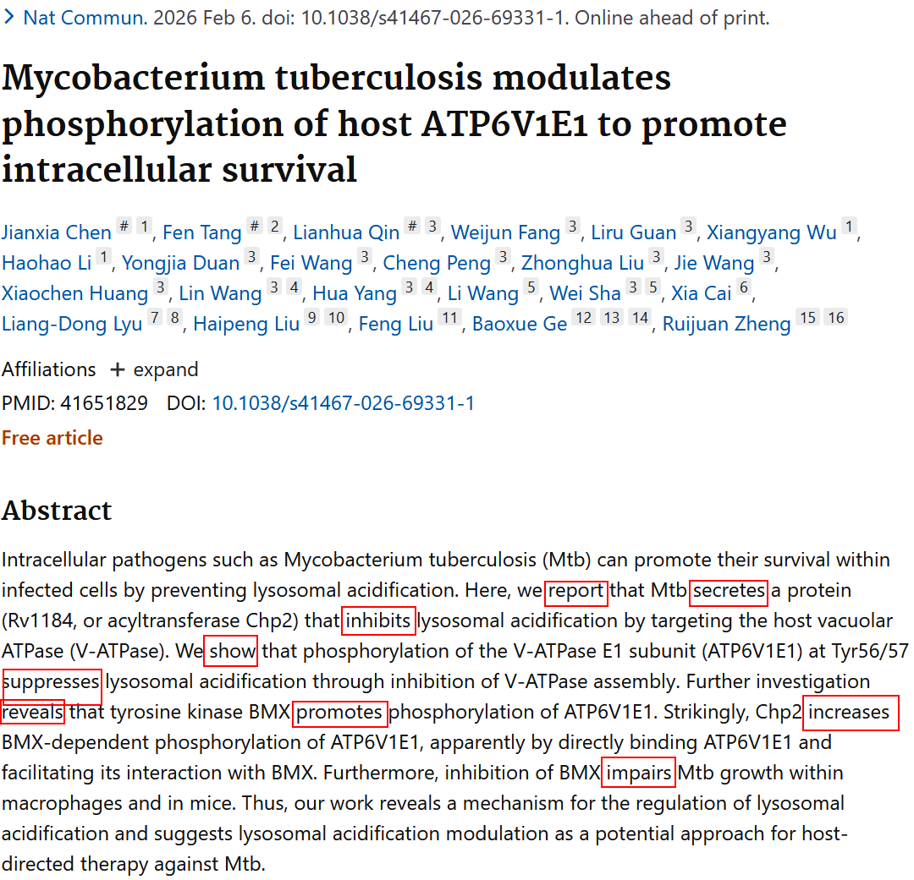
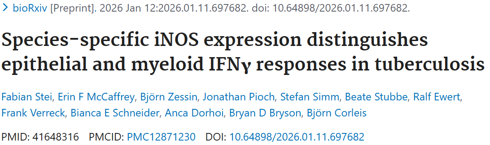
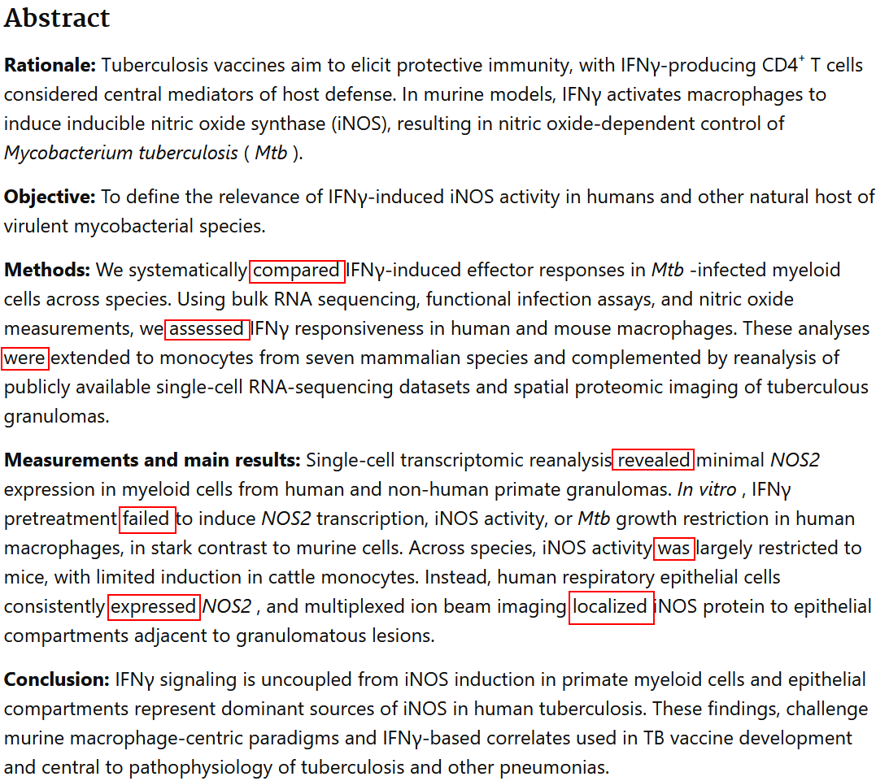
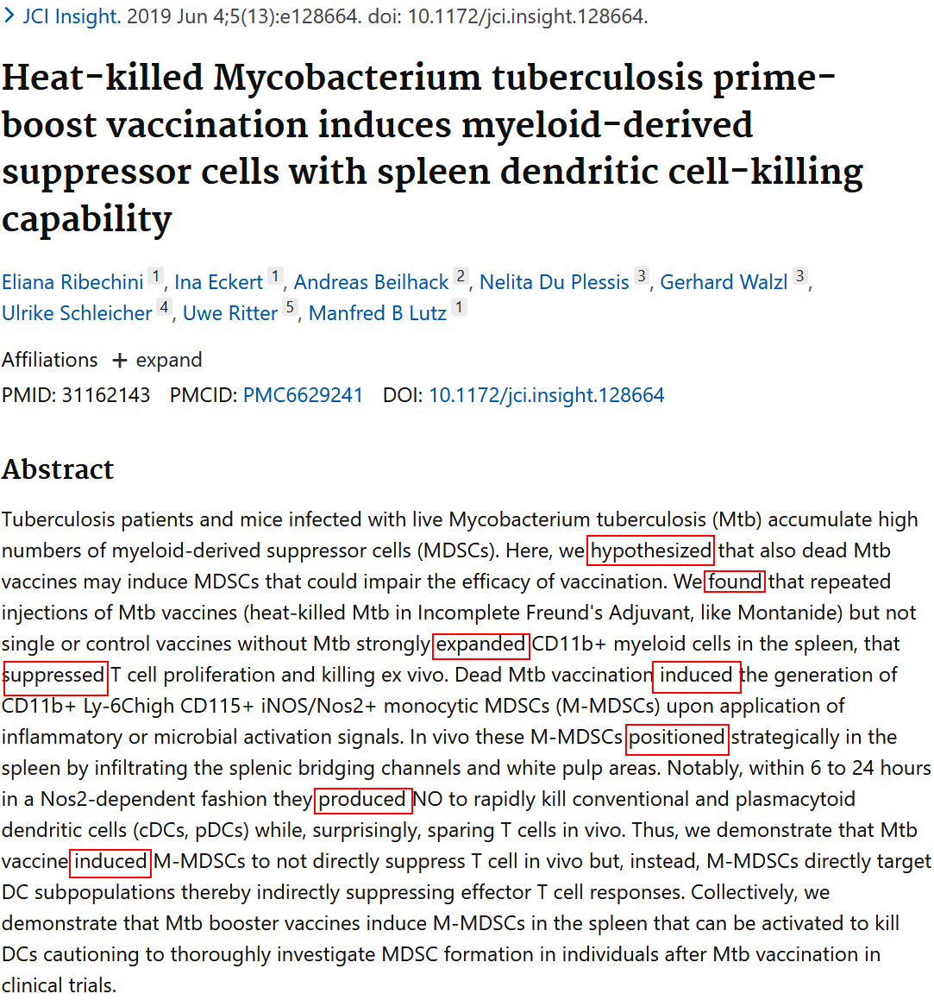

## 1.《How to Write and Illustrate a Scientific Paper》的描述

<center>
{width="60%"}
</center>

多年之前，因为想写英文文献（人生第一次），基本通读了《How to Write and Illustrate a Scientific Paper》（2nd edition）这本书。对于摘要（abstract）的方法和结果描述，该书认为应该用一般过去时：

> [Present tense]{.mark} is used for established knowledge ... [past tense]{.mark} is used for the results thant you are currently reporting.

> [Most of the abstract section describes your own present work; it is referred to in the past tense.]{.mark}

但实际并非如此。

## 2. 用一般现在时的两个文献摘要

留意<span style="color:red">红色方框</span>的动词的词性都是一般现在时。

<center>
{width="100%"}

{width="100%"}
</center>

## 3. 用一般过去时的两个文献摘要

留意<span style="color:red">红色方框</span>的动词的词性都是一般过去时。

<center>
{width="100%"}

{width="100%"}

{width="100%"}
</center>

## 4. 结论

摘要中对应的方法和结果部分，可以使用一般现在时，或者使用一般过去时；但不要混用一般现在时和一般过去时。

## 附录

实例3属于structured abstract，另外3个实例属于conventional abstract。

图片的<span style="color: red">红色方框</span>通过QuPath（v0.6.0）添加（即rectangle annotation）。&rarr; 之后通过groovy script保存图像（script见下方）。

```
// QuPath v0.6.0

// Get image name
def imageName = getCurrentImageNameWithoutExtension()

// Set the base directory
def baseDirectory = "d:\\path\\to\\your\\directory"

// Set the name going to be exported
def exportedImageName = buildFilePath(baseDirectory, "${imageName}_annotated.png")

// Write the full image, displaying objects according to how they are currently shown in the viewer
def viewer = getCurrentViewer()
writeRenderedImage(viewer, "${exportedImageName}")

println "${exportedImageName} saved!"
```

[给我买杯茶🍵](给我买杯茶.qmd)