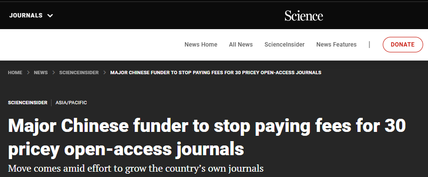

这几天时不时的从手机能够看到关于“据付高版面费”的相关新闻，也没细看。

刚好偶尔看到*Science*杂志的一个scienceinsider [@apc2026]，因此认真读了读，并提取些“干货”，并“有机”的调整结构，便于理解。

## 1. 中科院的“江湖”地位

> the Chinese Academy of Sciences (CAS，中科院), the [world’s largest research institution]{.mark} ... employs [more than 50,000 researchers]{.mark} across some 100 institutes.

## 2. 中科院的新版面费政策

> CAS ... [plans to stop]{.mark} paying to publish their papers in dozens of international free-to-read journals it regards as [too expensive]{.mark} ... include ***Nature Communications***, ***Cell Reports***, and ***Science Advances*** ... expected to take effect on 1 March.

> the draft policy (of CAS) would prevent CAS scientists from using [academy funds]{.mark} to pay article-processing charges (APCs) ... for more than 30 journals ( [> at least $5000 per paper]{.mark}).

> The policy also bars them from using [funds from other central government sources—presumably the Ministry of Science and Technology and the National Natural Science Foundation of China]{.mark}—to cover APCs in the proscribed journals.

> *Science Advances* (*SA*) ... charges an APC of $5450.

> *Nature Communications* (NC), and ... *Cell Reports* ... charge APCs of $7350 and $5790, respectively. 

> Globally the [average APC is about $2000]{.mark}.

## 3. *NC*和*SA*的来自中国的文章占比

> In 2025, approximately [10%]{.mark} of papers in *Nature Communications* and *Science Advances* had a CAS-affiliated author, and about [40%]{.mark} of papers in each had an author at any institution in China.

## 4. 中科院的新版面费政策补充

> They can also publish in [“hybrid” open-access journals]{.mark}, such as ***Nature***, that offer both paid open-access and paywalled options, but because that journal’s APC is $12,690, authors must publish behind the paywall, for which there is no charge.

## 5. 中国有多少英文的开放访问期刊且不收版面费

> by 2023 the country (China) had about [178]{.mark} English-language open-access journals, nearly half of which charged no APC.

## 6. 对其他中国机构的影响

> Other institutions in China may follow CAS’s lead.

## 7. 中科院做的其他引领的政策

> the institute (CAS) releases an [Early Warning Journal]{.mark} List each year naming journals that bear signs of research misconduct, charge expensive APCs, or both.

> the latest policy (of CAS) also [prevents]{.mark} the outlays (支出) for an additional 120 journals that have been flagged for research-integrity problems.

## 8. 其他国家对于高版面费的态度和做法

> For now, APC revenue flows mainly to international publishers, which many in [China and elsewhere]{.mark} see as an unsustainable practice that allows some of the world’s largest publishers to reap excessive profits.

> [Germany]{.mark}’s national science funder, the German Research Foundation, for example, caps its reimbursements for APCs, an approach that the [U.S. National Institutes of Health]{.mark} is considering adopting.

[给我买杯茶🍵](给我买杯茶.qmd)

## References